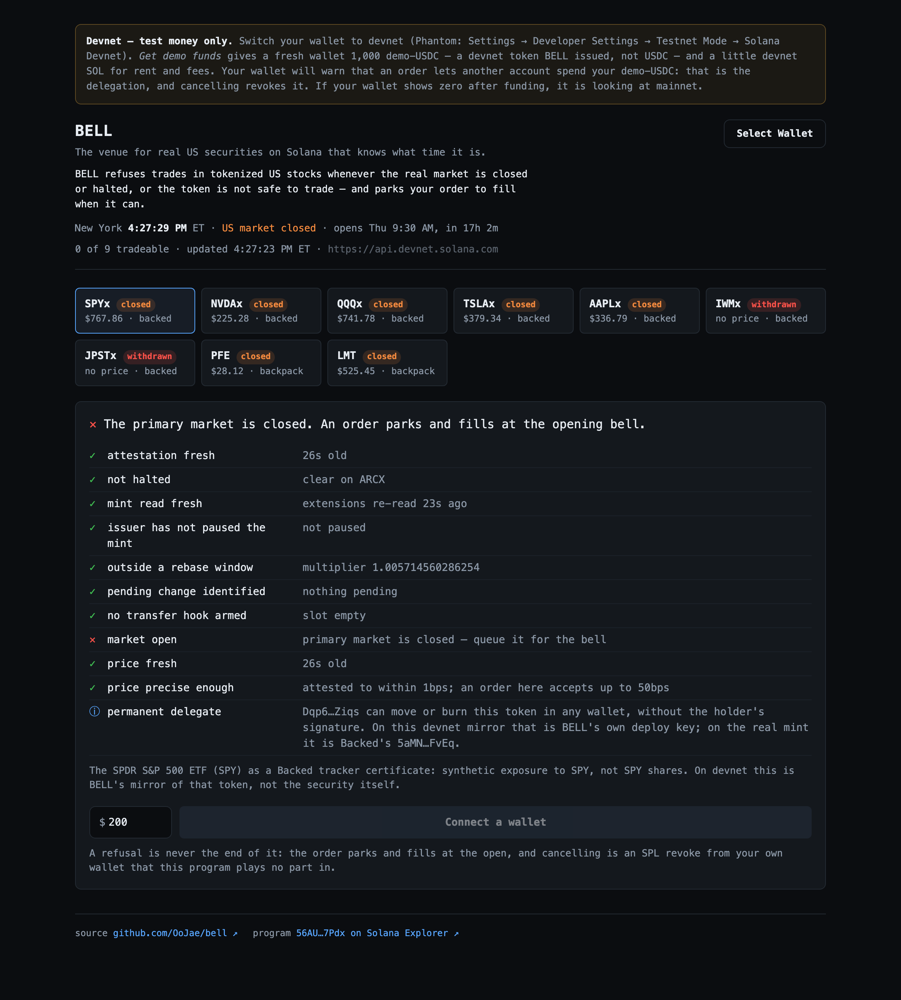

# BELL

**The venue for real US securities on Solana that knows what time it is.**

**The safe way to buy US stocks from your own wallet, at any hour.** Wall Street
closes; Solana doesn't — and while New York is shut, a Solana pool has nothing
to check its price against. US exchanges trade about 32.5 of the week's 168
hours ([RedStone's COO](https://crypto.news/tokenized-stocks-face-24-7-pricing-gap-redstone-coo/)).
Over Labor Day weekend a tokenized AMC traded at $18.04; the stock had
closed at $2.54 on 3 September ([crypto.news](https://crypto.news/robinhood-amc-tokens-expose-limits-of-short-squeezes/);
on Robinhood Chain, not Solana — the mechanism is the same).

In the regular session, BELL trades. When the stock is halted, or a dividend is
about to change the token under you, it refuses — on-chain, in the transaction,
not as a warning. And while New York is shut, it holds your order for a real
price and fills it after the bell, with your money in your wallet until then.

A dashboard can say a trade is risky; BELL is a program that makes it fail —
and turns the refusal into an order.

**Live:** https://web-production-f46ca9.up.railway.app
**Program:** [`56AUPR1c1Tq5AgMvAa3PASax61YYo1KTdocwW6pR7Pdx`](https://explorer.solana.com/address/56AUPR1c1Tq5AgMvAa3PASax61YYo1KTdocwW6pR7Pdx?cluster=devnet) (devnet)
**IDL:** on chain through the Program Metadata program, account [`C1dLwNvn2sMeNK8e8VhtfpoE7dRykTGYnM3YLzUq3Up8`](https://explorer.solana.com/address/C1dLwNvn2sMeNK8e8VhtfpoE7dRykTGYnM3YLzUq3Up8?cluster=devnet), so explorers decode BELL's instructions.



### Try it (about two minutes)

1. Switch your wallet to devnet — Phantom: Settings → Developer Settings →
   Testnet Mode → Solana Devnet.
2. Open the site and connect. Press **Get demo funds**: 1,000 demo-USDC (a
   devnet token BELL issued — not USDC) and a little devnet SOL for rent.
3. Pick a symbol and read the gate panel. While the regular session is closed —
   outside 09:30–16:00 ET on a trading day, to within one keeper tick — it
   refuses and offers to **queue the order for the opening bell**, optionally
   with your own limit price or at each of the next few opens; while the session
   is open, it takes it unless another gate refuses — a halt, a withdrawn token,
   a rebase. The panel also shows the Solana pool's price beside the US
   market's last trade.
4. Sign once. Your demo-USDC stays in your wallet — the order is funded by a
   delegation — and a filler that runs every five minutes settles it after the
   open. On 23 September it filled an overnight order at 09:35 ET. (A
   recurring buy is one approval and an order per open; when they do not fit
   in one transaction the page sends several, which most wallets sign in one
   prompt.)
5. To sell shares you hold, switch the order box to **Sell**: a number of
   shares, and optionally a minimum price a share. The approval is on your
   stock account, not your demo-USDC, and the shares stay in your wallet until
   a filler has paid for them. The first sale on devnet sold 0.02 SPYx for
   15.267831 demo-USDC at 10:04:28 ET on Thu 24 Sep
   ([transaction](https://explorer.solana.com/tx/4trvXZHKDPrjqSjkwshjiiztct3uwPQUXdaTK8Td5i5v5yGGH6fZPmWsQd1gRf3L4eWCLGYNRon1qUYuWoEW9VDm?cluster=devnet)).
6. Cancel any time: the first thing a cancel sends is an SPL `revoke` from your
   own wallet, on its own — on the demo-USDC account for a buy, on the stock
   account for a sale.
7. After a fill, **Your fills** shows the receipt: when it filled (and how long
   after the bell), what you paid or were paid a share, and how far over or
   under the price it was checked against. The site's tape route reads it back
   from the chain, and each line links to its transaction, so you can check it
   without us.

For builders: [`docs/INTEGRATE.md`](docs/INTEGRATE.md) shows how a wallet,
router, lending market or vault puts the same gate in front of its own trades.
For regulators and partners: [`NOTICE.md`](NOTICE.md) answers the SEC order's
disclosure items as BELL would (an unofficial draft, not a filing), and
`/api/tape` publishes every fill in the shape the order asks a venue to use.

**Your orders never touch a server of ours.** The browser reads Solana RPC
directly, your wallet signs, and your browser submits. The server has three
routes, and none is in the order, fill or cancel path: a devnet faucet
(`/api/faucet`) that funds a fresh wallet — its own key owns a pool of
demo-USDC and a little SOL, and it cannot mint or touch the program; the last
US price of each underlying (`/api/reference`, from Nasdaq, shown beside the
pool's price and read by nothing else); and the public tape (`/api/tape`,
every fill read back from the chain). The keeper writes attestations and marks
and re-reads the mints; a filler we run every five minutes
(`scripts/crank.ts`, which anyone holding the stock, or the quote to pay for a
sale, can run too) settles due orders. **Stop the keeper and everything reads
closed once its last attestation is two minutes old; stop the filler and orders
simply wait** — and `revoke` still cancels them from your wallet. That is
fail-closed as something you can watch rather than something we claim.

Devnet rather than mainnet, deliberately. The rent is the same on both: the
program data account, sized for a 420,000-byte program, holds 2.1345 SOL, and
`solana rent 420045` returns 2.13447884 SOL on devnet and mainnet alike. The
binary would be byte-for-byte the same, since nothing in it names a cluster.
Devnet SOL is free, and a judge can verify a devnet address exactly as well as a
mainnet one. Mainnet would have meant parking that SOL, recoverable only while
an upgrade authority stays live.

**What that costs in honesty, said plainly.** None of these securities exist on
devnet, so the live deployment trades against *mirror* mints.
`scripts/mirror-mints.ts` derives each one by reading the real mainnet mint's
extension state through this program's own parser and reproducing it — same
decimals, same scaled-UI multiplier, a pausable config, and the empty
transfer-hook slot the real ones carry. Each has a permanent delegate too, but
not the issuer's: on the mirrors it is BELL's own deploy key, `Dqp6…Ziqs`, and
the page says so. SPYx's mirror carries multiplier `1.005714560286254` because
that was the real mint's multiplier in force when it was mirrored.

So: **the 64 program tests parse real mainnet mint bytes, and
`scripts/localnet.sh` clones the real mainnet accounts. The devnet deployment
does not.** Those are different claims and this README keeps them apart.

It buys one thing mainnet cannot: we hold the mirror mint authorities, so a
multiplier activation can be *scheduled on demand* and gate 4 filmed refusing
across it. On mainnet only the issuer's multiplier authority can schedule one.

---

## Why this matters

Tokenized equities on Solana have a liquidity problem and a timing problem.

| | |
|---|---|
| Solana xStocks | **928** |
| Total DEX liquidity across all 928 | **$27.69M** |
| Share held by the top 20 names | **98.37%** |
| Names with under $1,000 of liquidity | **883 / 928** |
| Names with zero organic buyers in 24h | **904 / 928** |
| Organic buyers in 24h, summed across all 928 | **926** |

From the census taken 2026-09-20 22:18Z, committed as
[`docs/census-2026-09-20T22-18Z.json`](docs/census-2026-09-20T22-18Z.json). In
the same snapshot a $1,000 buy of UBERx was quoted at 80.2% price impact and
ASTSx at 99.96%, and MRKx and ACNx had no route at all. The universe has grown
since: 1,124 listings on 23 September.

`node scripts/measure.ts` takes a fresh snapshot from the same public,
unauthenticated endpoints and writes it to `data/snapshots/`.

### The timing problem is worse, because it is silent

A thin pool is visible. A stale one is not. Off-hours the primary listing
exchange is shut and the pool still quotes a price — so a trade executes against
a number the primary market has not checked since its close. The pool cannot
tell the difference.

The SEC's order on Tokenized Securities Venues (**34-106402**, 2026-09-17) makes
this a stated condition rather than a matter of taste. §II.H:

> "A TSV must stop trading in a Tokenized NMS Stock concurrently with any
> stoppage of trading in the underlying NMS stock on the primary listing
> exchange, which includes a halt or a suspension."

BELL enforces that sentence on-chain, without holding anyone's funds, and goes
further: it also holds orders while the regular session is closed, which the
order does not require. (BELL is not a TSV — a TSV must be a US person,
permissioned, and file a public notice — but the conditions are the ones a TSV
would have to meet; `NOTICE.md` answers them as BELL would.)

---

## The seven gates

Every trade passes one program. It refuses, in this order — cheapest and most
categorical first, so a refusal names the most fundamental reason rather than
whichever check happened to run first:

1. **State freshness** — an attestation older than 120s is not a green light. An
   attestor that goes dark closes the venue.
2. **Halt** — trading in the security is stopped: an exchange halt on its
   primary listing, or the issuer withdrawing its own token.
   **2b. Mint read fresh** — gates 3–6 are proven from the mint, but only as of
   the last read, so a read older than ten minutes is refused like a stale
   attestation. Anyone can re-read a mint, in front of their own transaction.
3. **Issuer pause** — `PausableConfig`, read from the mint itself.
4. **Rebase** — a `ScaledUiAmountConfig` activation. Refused within a guard
   window on **both sides** of the activation instant, and refused outright
   while a pending change is unclassified. Both halves matter: before, the order
   would settle in a different denomination than it was built for; after, a
   dividend has already stepped value-per-raw-unit up and the pool is stale-low
   by exactly that amount until arbitrage catches up.
5. **Multiplier moved** — the order was built against a multiplier that is no
   longer in force.
6. **Transfer hook** — an armed hook changes settlement semantics mid-flight.
7. **Market open** — for callers in `Strict` mode.

Four of those are proven on-chain by deserializing Token-2022 extensions
directly from the mint (`verify_token_risk`), not taken from an oracle. Only
session and halt need an attestation. **Both fail closed when they go quiet**: a
stale attestation is treated as closed, and a mint nobody has re-read in ten
minutes is refused the same way.

That second half was learned the hard way. For the first hours of the devnet
deployment, nothing re-read the mints at all — the refresh instruction existed,
was permissionless, and nobody called it — so four gates were checking a
registration-day snapshot. The keeper now re-reads every mint every tick, and
the program refuses to trust a read that has gone stale. See `AUDIT.md`,
"Reopened after deploy".

`check_tradeable` is one function. `assert_tradeable`, `fill_order` and
`fill_sell_order` all call *it*, not a reimplementation of it — two copies of a
safety check are two things to keep in sync, and the second one is where the
bug lives.

### It composes without a wrapper

`assert_tradeable` is a plain instruction. Put it first in a transaction and
Solana's atomicity does the rest, so a wallet or router adopts this by
prepending one instruction to whatever it already builds. No integration, no
CPI, no permission — and the code is under the MIT licence (`LICENSE`).

---

## A refusal is not a dead end

This is the part that keeps "we refuse trades" from being a worse product.

A refused order becomes a **bell order**: it parks and fills when the market
opens. Funding is by SPL delegation — the user `approve`s a capped amount and
**keeps their tokens**. Nothing is escrowed.

An order can carry the buyer's own limit, "no more than this a share", which
the program enforces as the order's floor; our filler leaves a limit below the
market waiting until the price comes down to it. A recurring buy is one bell order per upcoming
open, from the exchange calendar, each held back by the program until its own
open and lapsing six hours after it, all under one approval.

A **sale** is the same queue with its legs swapped (`place_sell_order`,
`fill_sell_order`, `cancel_sell_order`). The user approves their **stock**
account (Token-2022) to the same per-owner authority, for what that account's
live sales still need; the demo-USDC approval that funds their buys is never
touched by a sale. It waits for the bell like a buy, behind the same gate. At
the fill the filler pays first: the program measures the quote that landed in
the seller's account, and only then takes the stock. It must be at least the
stock's value at the mark in force, less the order's band (30 bps from the
page), and never less than the order's floor: the seller's own minimum a share,
or three quarters of the price at placement, whichever is higher. Each of those
minimums rounds up, in the seller's favour. So if the stock opens more than 25%
down, or under the seller's minimum, our filler will not pay the floor, the
program refuses anything less, and no stock is taken.

That choice has consequences worth stating:

- **Cancel is `spl_token::revoke`** — one standard instruction from the user's
  own wallet, on the account the order draws on (the demo-USDC account for a
  buy, the stock account for a sale), sent as its own transaction before
  anything of BELL's. It works if this program is frozen and our keeper is
  dead. BELL is not in the cancel path at all; closing the order for its rent
  comes second, and a failure there cannot undo the revoke.
- **If no filler ever comes, nothing happened.** The funds were never
  immobilised.
- **Spending the money, or moving the shares a sale offers, elsewhere silently
  invalidates the order.** That is the design, not a failure.
- Escrow would strand funds in exactly the cases the gate exists to catch — a
  halt, a rebase, an expiry.

Fills are permissionless. Any filler re-runs the identical on-chain gate and is
paid by the spread, so where anyone can hold the stock the venue does not depend
on our server. A filler needs stock to fill buys and quote to fill sales. On
devnet only we can mint the mirror stock, so in practice the filler of buys
there is ours; the quote a sale is paid in is demo-USDC, which the faucet gives
any new wallet. That openness has a cost, stated under "What you must trust".

---

## What is proven, not claimed

**On a local validator cloning the real mainnet mints** — the same bytes mainnet
has, not fixtures we wrote:

**Fail-closed, on a running validator.** Stop the keeper; once its last
attestation passes 120 seconds, every symbol refuses with `StateStale`,
including the deeply liquid ones. Nobody did anything. Silence closes the venue.

**A guarded trade, settled and aborted.** The same payload twice — the gate,
then a lamport transfer standing in for a swap: SPYx settled, IWMx aborted with
`MarketClosed`, recipient balance unchanged.

**The queue, end to end.**

```
market shut          → gate refuses
order queued         → by delegation; the quote never leaves the user's wallet
crank                → REFUSED  MarketClosed
attestor pushes open → crank → REFUSED  MarkStale
fresh mark lands     → crank → FILLED
```

The `MarkStale` step was not scripted. We rang the bell, expected a fill, and got
refused because the mark had aged past sixty seconds. An open market is not
enough; the price has to be fresh too.

**On a validator, recorded in `FRICTION.md` (22 September):**

**The revoke, proven the hard way.** Session forced open with a fresh mark so all
seven gates pass, order still standing on chain — and the fill still refuses,
with the token program's `OwnerMismatch` (custom 4, which the client names
`OwnerRevoked`), because the user revoked the delegation. The cancel genuinely
needs nothing from this program.

**On the live devnet deployment:**

- **A fill nobody watched.** On Wednesday 23 September the hosted crank — a
  Railway cron job every five minutes — filled an overnight $200 SPYx order in a
  block timestamped 09:35:24 ET, about five minutes after the bell: 200
  demo-USDC for 25,661,713 raw SPYx
  ([transaction](https://explorer.solana.com/tx/5mj8qKbkZLz1M4e8i1cA8rJRuQGkwrzC1QEgfbTvMNcrXabGrT79U8SBVzLgtfEBTP9zURvZxVaaBeQE7EwMCFqt?cluster=devnet)).
  It was not filmed; the transaction is the record.
- **The same, filmed.** On Thursday 24 September an overnight $200 SPYx order
  from the same wallet filled in a block timestamped 09:35:26 ET, five minutes
  after the bell: 200 demo-USDC for 25,915,945 raw SPYx
  ([transaction](https://explorer.solana.com/tx/5311pZ8D6WRdRyBZzSHM5VDHds4BmwUXagx17VjHTCHH2iqasHtANaiD8gzmdLXmBDMUx2qsjLiLKWKTbcd9xGVv?cluster=devnet)).
  The page was recorded from 09:25 ET, unattended, and the wallet signed
  nothing while it ran.
- **A sale.** 0.02 SPYx (1,988,635 raw) sold for 15.267831 demo-USDC, $763.39
  a share, 30 bps under the mark's $765.69, in a block timestamped 10:04:28 ET
  on Thu 24 Sep ([transaction](https://explorer.solana.com/tx/4trvXZHKDPrjqSjkwshjiiztct3uwPQUXdaTK8Td5i5v5yGGH6fZPmWsQd1gRf3L4eWCLGYNRon1qUYuWoEW9VDm?cluster=devnet)): the first sale on
  devnet. It was placed during the session with `queue.ts sell SPYx 0.02 700`,
  so it did not wait for a bell, and settled under a minute later by
  `scripts/crank.ts` run by hand, before the hosted crank had its sell loop. It
  was not filmed; the transaction is the record.
- **A refusal that landed.** Every client simulates before sending, so a
  refusal normally never reaches the chain. `BELL_ARM=1 node
  scripts/guarded-swap.ts --land SPYx` sends a refused leg past preflight: at
  16:26 ET the same day, from a throwaway wallet, it failed at the gate with
  `MarketClosed` (custom 6000), paid its 5,000-lamport fee, and the transfer in
  it never happened
  ([transaction](https://explorer.solana.com/tx/2Ue1towjdeQoG1Eeo7xC1tvfUpJ8VcBNxR14gXk8MiYnDyicQ4F4mtkXi4TVxx6ritLjkKGE5RZtCSs2Fq9Cr1pH?cluster=devnet)).
- **A new wallet's first order.** On the night of Tuesday 22 September a
  brand-new wallet — the scripted one in `scripts/demo/judge-path.ts` — was
  funded by the hosted faucet, placed an order on the live site and cancelled
  it, and recorded the revoke signed and landed first, on its own, then BELL's
  close.

**The close, and the thing we did not expect.** At the 16:00 ET bell on Monday
21 September, the keeper's tick log recorded the two sources never agreeing on
SPYx (and the other four Backed names still trading):

| time (UTC) | Pyth | issuer | BELL |
|---|---|---|---|
| 19:54:51 | open | open | tradeable |
| 19:55:38 → 19:59:31 | **open** | **closed** | refused |
| 20:00:17 → | **closed** | **open** | refused |

Ticks are about 45 seconds apart, so the issuer stopped between 19:54:51 and
19:55:38 — at least 4m22s before the bell at 20:00:00. Pyth marked the session
shut at 20:00:17, 4m39s after the first tick that saw the issuer stopped, by
which time the issuer's 24/5 wrapper read open again. **No tick around the bell
shows both agreeing the market was closed.** A venue trusting Pyth alone keeps trading
after the issuer has stopped; one trusting the issuer alone keeps trading after
the market has shut. BELL refuses across the whole window, because in both
directions the safe reading is the same.

That is a better argument for reconciliation than how often the sources agree.
Mid-session on 23 September (15:51 ET), 675 of the 678 xStocks with a Pyth
US-equity feed agreed with the issuer about whether they could trade; the three
that did not — JPSTx, IWMx and TQQQx — were tokens Backed had stopped while Pyth
said the session was open
([`docs/agreement-2026-09-23T19-51Z.json`](docs/agreement-2026-09-23T19-51Z.json),
from `scripts/agreement.ts`). At the boundary, where it matters, they did not
agree at all.

`EVIDENCE.md` is generated from the tick log by `scripts/evidence.ts`. Every
number in it is counted, not written by hand.

**Tests.** 64 program tests (litesvm; `test_gates.rs` 23, `test_queue.rs` 22,
`test_sell.rs` 19) against the deployed binary — the bytes on devnet hash to the
tested build — parsing real mainnet mint bytes, including a dividend walked end
to end on the real AAPLx mint's own scheduled step. No fixture is paused or
hooked, so those two gates are tested on a real mint with one field changed. Every refusal is
asserted by its exact error code, never a bare `is_err()`. 204 TypeScript tests
(`node --test test/*.test.ts`), including one file that removes Node's BigInt
`Buffer` methods so browser-only failures surface under Node, and checks every
enum the client mirrors against the program's IDL; 18 of the 204 cover
`reference/session.ts`, a reference model of the gates that nothing runs. The
judge path is scripted too: `scripts/demo/judge-path.ts` drives a real browser
against the live site with a scripted Wallet Standard wallet.

CI (`.github/workflows/ci.yml`) runs the TypeScript tests, both typechecks and
the web build on every push and pull request. It does not run `cargo test`,
which needs the Solana toolchain and the deployed binary, and that binary is not
committed. `.github/workflows/health.yml` reads the live deployment every 15
minutes, sends nothing, and fails — GitHub emails the owner — if an attestation
is over five minutes old, a mint has not been re-read in ten, a key or the
faucet pool runs low, or the site is down.

**Reviewed before deploy — an automated adversarial review (84 AI agents), not a
third-party audit.** Six reviewers across the delegation and queue surface, each
finding then attacked by three more instructed to refute it. 26 findings raised:
5 confirmed + 1 hardened, all fixed — including one that let anyone disarm the
rebase gate on any mint, and one that meant the browser could not place or
cancel an order at all. `AUDIT.md` has each finding, its fix and why the rest
died — and two more found afterwards by checking the live deployment against
its own claims, one of them a finding the refuters had killed. A post-deploy
adversarial study (196 AI agents; 62 findings raised, 53 surviving refutation,
merged into 22 items) followed; its fixes are commits `c91ae43` and `29ce852`.
Sell orders came after both, and neither covered them.

---

## What you must trust

Stated plainly, because a guard product that hides its own trust assumptions is
worth less than no guard at all.

**The attestor is trusted, and here is exactly how far.** One hot key can open
or close a symbol (`push_session`), set its price, the *mark* (`push_mark`), and
classify a pending corporate action (`classify_rebase`). It cannot touch the
program, transfer anyone's tokens, or place or cancel an order in anyone's name.

But `fill_order` and `fill_sell_order` are permissionless, so a leaked attestor
key can open a symbol, push a bad price and fill parked orders against it
itself. What bounds that:

- **A loss floor on the order**, three quarters of what the mark said the order
  was worth at placement, or the buyer's own limit where that asks for more. On
  a sale the floor is a minimum price: three quarters of the price at
  placement, or the seller's own minimum where that is higher.
  The page and `scripts/queue.ts` set it; the program accepts any floor, and a
  buy placed when a symbol had no mark yet has none (a sale cannot be placed
  without a mark). Where there is one, a leaked key pushing a false price cannot
  fill the order for dust.
- **$1,000 per order** (`MAX_ORDER_IN`), enforced by the program. A sale is
  sized in shares, so its cap is its value at the mark in force when it is
  placed, rounded down. That mark needs a price, not a fresh one, so a sale
  placed while the mark is old is sized at the old price; the fill still
  refuses a stale mark.
- `Mode::Strict` is **not** an independent bound: the same key attests the
  session. It limits fills to when the attested market is live, which makes an
  honest mark arbitrageable — it does not stop a dishonest one.

So "fails closed" is true of a *silent* attestor — its attestations go stale and
everything refuses — and not of a *leaked* one, which can open a symbol that
should be shut. A swap guarded by `assert_tradeable` elsewhere gets neither the
floor nor the cap; a wrongly opened symbol lets it through, limited only by its
own slippage.

**The upgrade authority is live.** Until
`Dqp6DbUh6j5Jddff9VHPAK1UpByo85NhLVw83S58Ziqs` is burned, a malicious upgrade
could take whatever you currently have approved — your open orders plus any
approval not revoked — each order capped at $1,000 (a sale at its value when
placed). Burning it is the production step and is named as such rather than
quietly skipped.

**One delegate slot per token account.** SPL delegation is per-owner, not
per-order, so a `revoke` unfunds every one of your orders at once, and placing
one re-approves the whole book, less any order that can no longer fill.
Cancelling one order therefore revokes, closes it, and only then re-approves the
others — never the other way round, which would leave the cancelled order
fillable until its close landed. Buys and sales never share a slot: a buy's
approval is on the demo-USDC account and a sale's on the stock account, so
cancelling a sale leaves every buy funded, and the reverse. A **Revoke all
funding** button is always on screen while BELL holds any approval, on either.

**What a sale trusts.** The same as a buy, with the legs swapped: the filler
pays first, and the program measures the quote that landed in the seller's
account before it moves any stock, so a short payment takes nothing. One
behaviour is documented rather than prevented. A filler may name the seller's
own stock account as where the stock goes; the take is then a transfer from
that account to itself, so the seller is paid, keeps the shares, and the order
closes, and only the filler loses. The seller's approval on that account then
stays standing until they revoke it, or place or cancel another sale from it,
which resets it to what their live sales need; the page shows it, and **Revoke
all funding** clears it (`AUDIT.md`, "Sell orders").

**Every one of these mints has a `permanentDelegate`, and two keys cover all
nine.** Not some of them — all nine, verified against the real mainnet accounts:

| | |
|---|---|
| `5aMNNLQJwAEeoemTEMkv5NVjqKwvvefRYCQ5Z67HFvEq` | all seven Backed xStocks |
| `2cVYpagTt7ZGc3mmTXBa7fAznUtx5DUu6aCq8uVDaf4a` | both Backpack entitlements |

A permanent delegate can move tokens out of any holder's account without that
holder's signature, at any time, for any reason. So two keys can take any
holding of these nine tokens, after any fill, on any venue — and nothing about
BELL changes that. On the devnet mirrors the delegate is BELL's own deploy key,
`Dqp6…Ziqs`, the same key as the upgrade authority.

Reproduce it: `spl-token display <mint> --url mainnet-beta` against any of the
nine.

`TokenRisk` records it and the page shows it in a disclosure row, which is the
whole of what a guard can honestly do here. This is a disclosure, not a
mitigation, and it is the strongest reason to read these mints rather than trust
a price feed about them: **the risk that matters most is written on the mint, not
in any price.**

**An issuer can change a multiplier with no warning at all.** Gate 4 refuses
for fifteen minutes either side of a *scheduled* activation, and a scheduled one
is visible on the mint before it lands. But Token-2022 lets the multiplier
authority set an effective time of zero or in the past, and applies it
immediately — there is no pending state for any reader to see beforehand. Gate 4
measures its window from the time written on the mint, so zero, or a time more
than fifteen minutes gone, leaves no window to refuse in. The first sign is the
multiplier having moved, which gate 5 does catch for any order built on the old
one; a *new* trade after such a change is then not protected. Nothing on-chain can defend against the
issuer doing this, and BELL says so rather than implying otherwise.

**Prices are not Pyth.** A free Pyth key returned 403 for every stock-related
feed we tried, and 200 for `Crypto.SOL/USD`. Sessions come from Pyth's free, keyless
`/v2/price_feeds` metadata, checked against a local NYSE calendar that also
stands in when a feed is missing, and marks from one executable Jupiter quote per
symbol; a mark's `conf_bps` is that quote's price impact, capped at 200, not a
disagreement between sources. See `docs/PYTH.md`.

**Known, not yet fixed.**

- Registration is first-come, and the page and the filler do not verify a
  symbol's attestor (`guardInstructions` checks one when an integrator pins
  it). All nine live records name the right one.
- Session and mark pushes do not require a newer timestamp than the one they
  replace.

---

## On the regulatory framing

BELL is **not** a registered TSV and must not be read as one. A TSV must be a
U.S. person, publish a public Notice, and give an issuer 30 days' notice in
which to object. BELL is none of those. It is a reference implementation of the
operating conditions, and a non-custodial guard any venue can adopt under the
MIT licence.

The order's §I excludes "securities where a third party issues a crypto asset
representing its own security that provides synthetic exposure to an underlying
security, such as a tokenized linked security or a tokenized security-based
swap." Backed's xStocks are Swiss tracker certificates, which on a plain reading
is that structure. **That reading is analysis, not a legal opinion**, and the
quote is there so you can judge it yourself.

One correction we made rather than buried: we first read Backed's
`isTradingHalted` as an exchange halt. It is not. Cross-checked on 21 September
against Nasdaq's UTP feed — which does carry NYSE Arca halts — IWM and JPST were
absent. The Russell 2000 ETF was not halted; Backed had withdrawn its own token.
Both stop a trade, but §II.H is about the exchange halt, and claiming one that
never happened would be a false statement about one of the world's most liquid
ETFs. They are distinct inputs now, with a test asserting the issuer case never
produces exchange wording.

The program's own message lagged that correction. Until 23 September,
`MarketClosed` (6000) read "Primary listing exchange has halted or suspended
this security" — printed for SPYx on any weeknight and for issuer withdrawals.
A message-only upgrade at 15:32:46 ET that day (slot 503099324) changed it to
"Market is closed or trading in this security is stopped", and `StateStale` to
"Session state is stale; treated as closed". Every error code kept its number.

---

## Run it

Requires Rust 1.89.0 (pinned in `rust-toolchain.toml`), Agave 4.1.2, Anchor
1.2.0 and Node 26 (which runs TypeScript natively — there is no build step).
Build the program first, as `docs/SETUP.md` describes: `localnet.sh` loads
`target/deploy/bell_session.so`, which is not committed.

```bash
pnpm install
solana-keygen new --no-bip39-passphrase -s -o .filler.json   # the filler's key
node scripts/seed-accounts.ts  # its stock inventory → localnet/ (see below)
./scripts/localnet.sh &        # validator cloning the real mainnet mints
./scripts/demo-setup.sh        # local quote asset → .demo.env and web/.env.local
node --env-file=.demo.env scripts/register.ts   # set up the nine symbols
BELL_ARM=1 node scripts/keeper.ts   # sense → reconcile → attest, every 45s

node scripts/gate.ts           # what the chain says about each symbol, right now
node --env-file=.demo.env scripts/queue.ts place SPYx 200
node --env-file=.demo.env scripts/crank.ts   # try to fill; watch it refuse and say why

cd web && pnpm dev             # the refusal screen, at :3100
```

`demo-setup.sh` writes the quote mint and your quote account to `.demo.env`.
Nothing loads that file for you, hence `--env-file`. It refuses to run a second
time, because a second quote asset would orphan the marks bound to the first.

The filler's stock is not committed either. `seed-accounts.ts` writes it to
`localnet/` for your `.filler.json`, along with the `--account` flags that
`localnet.sh` reads from `localnet/accounts.flags`. To fill a sale the filler
pays instead, from its quote account (`BELL_FILLER_QUOTE`), which
`demo-setup.sh` creates empty: until buys have paid into it, or you send it
some, the crank reports the filler short, not the seller.

`queue.ts place` uses your wallet's own token accounts and creates the stock
one in the same transaction if it does not exist yet; `BELL_USER_QUOTE` and
`BELL_USER_STOCK_<SYMBOL>` override them. `queue.ts sell SPYx 0.1 [MIN_USD]`
sells stock the wallet already holds, from that same stock account, which it
does not create; `queue.ts cancel-sell NONCE` revokes the stock approval, then
closes the order.

Order matters: a mark binds its quote mint permanently, so the quote asset has
to exist before the symbols are registered. `register.ts` refuses rather than
binding a mark to a mint that is not there.

To see fail-closed: stop the keeper, wait three minutes, run `scripts/gate.ts`
again. Everything refuses.

---

## Architecture

```
sensors → policy/reconcile → keeper → [ bell-session program ] ← browser
                                            ↑
                                    fillers (permissionless)
```

- **`programs/bell-session`** — the gate, the Token-2022 reader, and the queue,
  in one program. One deploy, one rent payment.
- **`src/sensor/`** — xStocks, Backpack, Pyth, Nasdaq UTP halts, Jupiter. All
  public and unauthenticated, so the demo does not depend on anyone's API key.
- **`src/policy/reconcile.ts`** — merges the sources and closes a symbol when a
  source it needs is missing. Pyth knows the session, the issuer knows its own
  token, and Nasdaq's feed knows exchange halts. A local NYSE calendar
  (`src/policy/calendar.ts`) checks Pyth: if the two disagree about the
  session, the symbol closes. If Pyth's feed is missing, the calendar stands in
  rather than closing the venue for a vendor outage — a deliberate trade, and
  the one place it loosens anything: such a listing opens only when the
  calendar says the regular session is open *and* the issuer is trading, and
  the verdict is logged as degraded. **When the session is open and the issuer
  will not trade a name, that disagreement is the stop.**
- **`scripts/crank.ts`** — the filler, run by us as a five-minute cron job and
  by anyone else holding the stock, or the quote for sales (on devnet, only we
  can mint the stock). It re-runs the identical on-chain gate and re-reads the
  mint in the same transaction as each fill, and delivers the band edge or the
  buyer's floor, whichever is more. On a sale it pays the band edge or the
  seller's floor, whichever is more, rounded up exactly as the program rounds
  it, and waits while the seller's minimum is above the market.
- **`web/`** — Next.js. Orders go browser → wallet → chain with no server of
  ours in between; the server routes are the devnet faucet and two read-only
  views (the US reference price and the tape). The site keeps
  working whether or not our keeper is up, and when the keeper is down it
  correctly shows everything closed.

The front end imports the keeper's own modules from `src/` — one codec, one
client — and for the symbol on screen it asks the program itself, by simulating
`assert_tradeable`. A UI that reimplements the rules is a UI that will
eventually lie about them.

**Why Solana.** The guard is a plain instruction, callable by CPI as well as by
prepending it, so the protection composes into any lending market, vault or
wallet. `scaledUiAmount` is a Token-2022 extension, and the trap below is
specific to it. And the SEC's order makes it a condition that a TSV's
smart contracts be public and deployed on a public, permissionless ledger
(§II.A).

---

## The trap that justifies reading mints on-chain

`ScaledUiAmountConfig` carries **two** multipliers. The field named `multiplier`
is stale once `newMultiplierEffectiveTimestamp` has passed. NFLXx's mainnet mint
reports `multiplier 1.0` beside `new_multiplier 10.0` — so the obvious read is
wrong by an entire 10:1 split.

We only caught it because the tests use real mainnet mint bytes. A split and a
dividend are both just a multiplier change and they have opposite consequences
for an AMM: a split leaves value per raw unit invariant, while a dividend steps
it up at a known instant, leaving the pool stale-low by exactly the dividend
from the first block after activation.

More of these in `FRICTION.md`, including what building the front end found.
